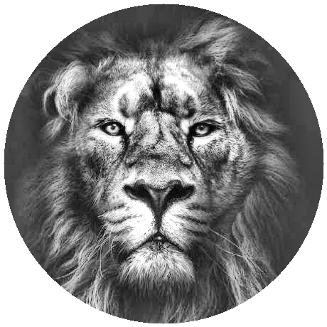

<!-- ===================== TERMINAL CARD HERO ===================== -->

<!-- hero: monochrome ASCII portrait (types in) beside a neofetch-style info panel.
     regenerate portrait: python scripts/prep_photo.py && python scripts/make_ascii_svg.py
     info panel: python scripts/make_info_card.py -->
<h3><code>neel@github ~ $ cat profile.json</code></h3>
<table>
<tr>
<td valign="top"></td>
<td valign="top"></td>
</tr>
</table>

 
 

<h3><code>neel@github ~ $ ./connect.sh</code></h3>

<b>AI Engineer · Full-Stack Dev · Hackathon Winner</b>

 

 

<!-- ===================== MARIO BANNER (moved below) ===================== -->

  
<!-- ===================== HEADER / WAVING BANNER ===================== -->

 

<table>
  <tr>
    <td width="55px" align="center">🔭</td>
    <td>Currently engineering <b>AI platforms that solve real problems</b> — from crop disease detection for farmers to NASA-powered environmental monitoring.</td>
  </tr>
  <tr>
    <td align="center">🌱</td>
    <td>Leveling up in the <b>React.js & Next.js</b> ecosystem while sharpening <b>C++ / Java</b> for competitive programming.</td>
  </tr>
  <tr>
    <td align="center">🤝</td>
    <td>Open to collaborating on <b>national-level hackathons</b>, <b>Generative AI</b>, and <b>full-stack MERN</b> projects.</td>
  </tr>
  <tr>
    <td align="center">💬</td>
    <td>Ask me about <b>winning NASA Space Apps</b>, building <b>AI for agriculture</b>, or surviving a 30-hour national hackathon.</td>
  </tr>
  <tr>
    <td align="center">⚡</td>
    <td><i>Don't just build models — build things that ship.</i></td>
  </tr>
</table>

<!-- ===================== TECH STACK ===================== -->
##  &nbsp;Tech Arsenal

### 💻 Languages

### 🌐 Web & Frameworks

### 🤖 AI / ML

### 🗄️ Databases & Cloud

### 🛠️ Tools

<!-- ===================== FEATURED PROJECTS ===================== -->
##  &nbsp;Featured Projects

 

<table width="100%">
  <tr>
    <td width="2%"></td>
    <td width="46%" valign="top">
      <h3>🌾 AgriForge — KrishiMitra</h3>
      <b>AI/ML • Computer Vision • Smart Agriculture</b>
      
AI-powered agricultural assistant giving farmers <b>24×7 support across 10+ Indian languages</b> via voice & text. Integrated an <b>EfficientNet</b> computer-vision model for crop disease detection from leaf imagery.

      
🏅 Secured <b>₹2.43 Lakh research funding</b> under SSIP, Govt. of Gujarat.

      

        
        
        
        
      

    </td>
    <td width="4%"></td>
    <td width="46%" valign="top">
      <h3>🏙️ Urban Intel AI</h3>
      <b>AI/ML • Predictive Analytics • Local LLM</b>
      
Hybrid AI system using <b>6 Random Forest models</b> to forecast urban risks — traffic congestion, water scarcity & public health hazards. Runs a <b>private TinyLlama LLM</b> for real-time policy recommendations with full data sovereignty (no external APIs).

      
🥈 <b>1st Runner-Up</b> — 2nd of 180+ teams @ Ingenius Hackathon 7.0.

      

        
        
        
        
      

    </td>
    <td width="2%"></td>
  </tr>
  <tr>
    <td width="2%"></td>
    <td width="46%" valign="top">
      <h3>🛰️ Mumbai Pulse (CityFage)</h3>
      <b>AI/ML • Geospatial Analysis • NASA Data</b>
      
AI system leveraging <b>NASA Earth observation datasets</b> to monitor air quality, urban heat & environmental risks across Mumbai.

      
🏆 <b>1st Place — NASA Space Apps Challenge 2025.</b>

      

        
        
        
        
      

    </td>
    <td width="4%"></td>
    <td width="46%" valign="top">
      <h3>🩺 Eunoia Homoeopathy</h3>
      <b>Web Development • UI/UX • Deployment</b>
      
Shipped & deployed a <b>live production website</b> for a homoeopathy clinic — owning UI/UX design, domain setup, hosting and end-to-end deployment against real client requirements.

      
🚀 Live client project, fully deployed.

      

        
        
        
        
      

    </td>
    <td width="2%"></td>
  </tr>
  <tr>
    <td width="2%"></td>
    <td width="46%" valign="top">
      <h3>🐄 Hackovate LJ — Cattle Health ML</h3>
      <b>AI/ML • Sensor Data • Predictive Pipeline</b>
      
Built an <b>ML pipeline predicting cow milk yield and health anomalies</b> using sensor data and historical records.

      
🎯 <b>Finalist</b> at Hackovate LJ.

      

        
        
        
      

    </td>
    <td width="4%"></td>
    <td width="46%" valign="top">
      <h3>🚀 MindForge</h3>
      <b>Generative AI • Full-Stack • No-Code</b>
      
A universal AI-powered platform that <b>generates websites and apps from natural language</b> prompts.

      
🔧 Actively in development — pushing GenAI pipelines to ship real products.

      

        
        
        
      

    </td>
    <td width="2%"></td>
  </tr>
</table>

<!-- ===================== ACHIEVEMENTS ===================== -->
##  &nbsp;Achievements & Honors

<table>
  <tr>
    <td width="60%" valign="top">

| 🏆 Achievement | 📋 Detail |
|:---|:---|
| 🥇 **Winner — NASA Space Apps Challenge 2025** | Built *Mumbai Pulse (CityFage)*, an AI system analyzing NASA datasets for environmental monitoring |
| 🥈 **1st Runner-Up — Ingenius Hackathon 7.0** | Ranked **2nd among 180+ teams**, Ahmedabad University |
| 🥈 **2nd Rank — IBM AI Innovation Challenge 2026** | Statewide (Gujarat) — AI solution for India's agricultural ecosystem |
| 🎖️ **Finalist — DotSlash 9.0** | 30-hour national hackathon, NIT Surat (SVNIT), March 2026 |
| 🎖️ **Finalist — HackBaroda 2026** | Gujarat state-level innovation sprint, Vadodara |
| 🎖️ **Finalist — Hackovate LJ** | Cattle health & milk-yield ML pipeline |
| 🛰️ **Participant — ISRO SpaceTech Innovation Hackathon** | National-level geospatial / satellite-data solutions |

  </td>
    <td width="40%" align="center" valign="middle">
      
    </td>
  </tr>
</table>

<!-- ===================== LEADERSHIP ===================== -->
##  &nbsp;Leadership & Community

- 🌐 **Web Team Lead** — *Code Vimarsh Club, MSU Baroda* — Leading the web team on club projects, coordinating contributors & supporting technical initiatives across events.
- 🤖 **AI/ML Team Lead** — *Neuralize Club, MSU Baroda* — Driving AI/ML initiatives: organizing workshops, mentoring peers & supporting hackathon activities.
- 🗣️ **AI/ML Community Engagement** — Organizing AI/ML discussions, workshops & hackathon collaborations across university communities.

<!-- ===================== PROGRAMS & CERTS ===================== -->
##  &nbsp;Programs & Certifications

<!-- ===================== GITHUB STATS ===================== -->
##  &nbsp;GitHub Analytics

  

<!-- Stats — using local assets for reliable display -->

  

  

 

<!-- ===================== QUOTE ===================== -->

 

<!-- ===================== CONTRIBUTION SNAKE ===================== -->
##  &nbsp;Contribution Snake

<picture>
  <source media="(prefers-color-scheme: dark)" srcset="https://raw.githubusercontent.com/platane/snk/output/github-contribution-grid-snake-dark.svg">
  <source media="(prefers-color-scheme: light)" srcset="https://raw.githubusercontent.com/platane/snk/output/github-contribution-grid-snake.svg">
  
</picture>

<!-- ===================== FOOTER ===================== -->

### 💌 Let's build something that ships.

  

