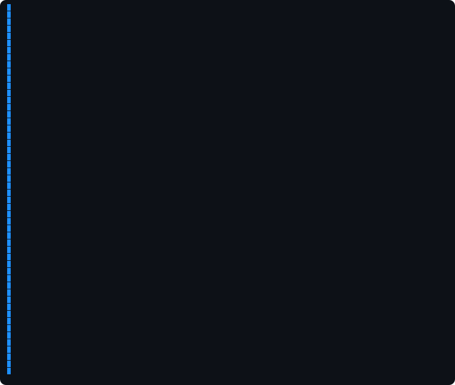
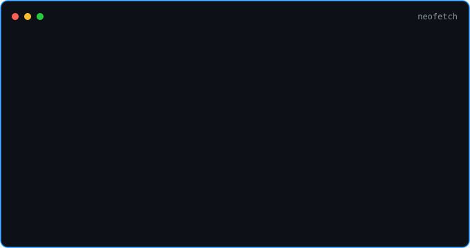

<!-- =====================================================================
     NEEL'S PRIDE.OS — profile README
     assets/*.svg are self-contained (inline fonts + images, CSS + SMIL only).
     Bump ?v=1 -> ?v=2 on an image link whenever you replace its SVG.
     Kept as-is from the original: neel-ascii.svg, info-card.svg, contrib-heatmap.svg
     ===================================================================== -->

 

<h3><code>neel@github ~ $ cat profile.json</code></h3>
<table>
<tr>
<td valign="top"></td>
<td valign="top"></td>
</tr>
</table>

 

<h3><code>neel@github ~ $ ./contributions.sh</code></h3>

 

<h3><code>neel@github ~ $ ./about.sh</code></h3>

 

<h3><code>neel@github ~ $ ./stack.sh</code></h3>

 

<h3><code>neel@github ~ $ ./projects.sh --featured</code></h3>

<table width="100%">
<tr>
<td width="50%" valign="top">
<h3>🌾 AgriForge · KrishiMitra</h3>
<b>AI/ML · Computer Vision · Smart Agriculture</b>

AI-powered agricultural assistant giving farmers <b>24/7 support across 10+ Indian languages</b> via voice &amp; text. Integrated an <b>EfficientNet</b> computer-vision model for crop disease detection from leaf imagery.

🏅 <b>2nd Rank</b> · IBM AI Innovation Challenge 2026 &nbsp;·&nbsp; 💰 <b>₹2.43 Lakh</b> research funding under SSIP, Govt. of Gujarat.

</td>
<td width="50%" valign="top">
<h3>🌆 <a href="https://github.com/Neel-2606/City-Forge_Mumbai-Pulse">CityForge · Mumbai Pulse</a></h3>
<b>NASA Data · Next.js · Flask · 5 ML models</b>

Urban environmental-resilience platform for Mumbai built for <b>NASA Space Apps 2025</b>. Fuses MODIS, VIIRS, SMAP, OMI &amp; NASA POWER data with five ML models to surface air quality, urban heat, flood risk and short-term forecasts in one dashboard.

🏆 <b>NASA Space Apps Challenge 2025 — Winner</b>

</td>
</tr>
<tr>
<td width="50%" valign="top">
<h3>🛰️ <a href="https://github.com/Neel-2606/TerraForge">TerraForge · Environmental Intelligence OS</a></h3>
<b>Hybrid Edge-AI · FastAPI · PyTorch · React</b>

Bridges rural agricultural diagnostics and government policy strategy. Traces how wildfires, pollution, weather and water quality cascade into crop health and local economies, and serves it to <b>farmers and officials</b> — with edge-AI, not an always-on cloud wrapper.

</td>
<td width="50%" valign="top">
<h3>🏙️ <a href="https://github.com/Neel-2606/Urban-Intel-AI">Urban Intel AI</a></h3>
<b>AI/ML · Predictive Analytics · Local LLM</b>

Hybrid AI system using <b>6 Random Forest models</b> to forecast urban risks — traffic congestion, water scarcity &amp; public health hazards. Runs a <b>private TinyLlama LLM</b> for real-time policy recommendations with full data sovereignty (no external APIs).

🥈 <b>1st Runner-Up</b> — 2nd of 180+ teams @ Ingenius Hackathon 7.0.

</td>
</tr>
<tr>
<td width="50%" valign="top">
<h3>⛓️ <a href="https://github.com/Neel-2606/Arbitrum-Builder-Lab-Workshop">ChainLens · Arbitrum Builder Lab</a></h3>
<b>Web3 Education · TanStack Start · Turso</b>

Interactive full-stack Web3 learning platform: explore Arbitrum Layer 2 concepts, track live crypto prices and <b>mine a real proof-of-work blockchain in your browser</b>.

🔗 <a href="https://arbitrum-builder-lab-workshop.vercel.app/"><b>Live demo</b></a>

</td>
<td width="50%" valign="top">
<h3>🧠 <a href="https://github.com/Neel-2606/MindForge">MindForge</a></h3>
<b>Generative AI · Full-Stack</b>

AI-powered web development tool that turns plain text prompts into complete, working websites, apps and games using Google's Gemini API.

</td>
</tr>
</table>

Also shipped: <a href="https://neelprajapatiportfolio.work">Portfolio</a> · <a href="https://github.com/Neel-2606/Neel-New-Portfolio">Portfolio source</a> · <a href="https://github.com/Neel-2606/Code-Vimarsh">Code Vimarsh</a> · <a href="https://github.com/Neel-2606?tab=repositories">all repositories →</a>

  

<h3><code>neel@github ~ $ ./constellation.sh</code></h3>

 

<h3><code>neel@github ~ $ ./id.sh</code></h3>

 

<h3><code>neel@github ~ $ ./leadership.sh &amp;&amp; ./programs.sh</code></h3>

| Role / Program | Where | What |
|---|---|---|
| 🧑‍💻 **Web Team Lead** | Code Vimarsh Club, MSU Baroda | Leading the web team on club projects, coordinating contributors and supporting technical initiatives. |
| 🤖 **AI/ML Team Lead** | Neuralize Club, MSU Baroda | Driving AI/ML initiatives: workshops, peer mentoring and hackathon support. |
| ☁️ **Google Cloud Career Launchpad** | Diamond League |  |
| 🚀 **Prompt to Prototype** | Scaler |  |
| 🏢 **Tech Job Simulation** | Deloitte × Forage |  |

 

<h3><code>neel@github ~ $ ./analytics.sh</code></h3>

 

<h3><code>neel@github ~ $ ./connect.sh</code></h3>

 

<!-- Links inside an SVG  are NOT clickable on GitHub, so the real links live here. -->

 

